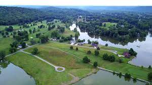

# Perry-Park
## Located at 595 Springport Ferry Rd. Perry Park KY, 40363

### Perry Park used to be a large slave plantation owned by the Perry family during the time of the civil war.
### It later became a golf course in the late 1960's.
### My father and his family bought the land in the 1990's and have owned and maintained it ever since.
### I have spent countless hours around this land, and it is of great importance to me.
### I hope to give this map of Perry Park along with my other maps to my Dad on Father's Day.

#### This is an overview photo of the resort.

 

## Perry Park Slide Show
# The slide show can be viewed in the link provided
# The slide show gives a 3D animation view of the first few holes on the Buckskin Golf Course.

.png)
[Slideshow link](ElliottBerlingFinal/slideshow.html)

## Our House's Topo Map
# I created a topographic map for my Dad around our house. I know he works with topographic map everyday so I think he will enjoy this.
# Our house is indicated my the red arrow in the picture below.
# The interactive map can be seen in the link below.

[map link](ElliottBerlingFinal/Mapbox.html)

<!DOCTYPE html>
<html>

<head>
  <meta charset='utf-8' />
  <title>Display a map</title>
  <meta name='viewport' content='initial-scale=1,maximum-scale=1,user-scalable=no' />

  
  <link href='https://api.mapbox.com/mapbox-gl-js/v2.2.0/mapbox-gl.css' rel='stylesheet' />

  
</head>

<body>

  

  

</body>

</html>
